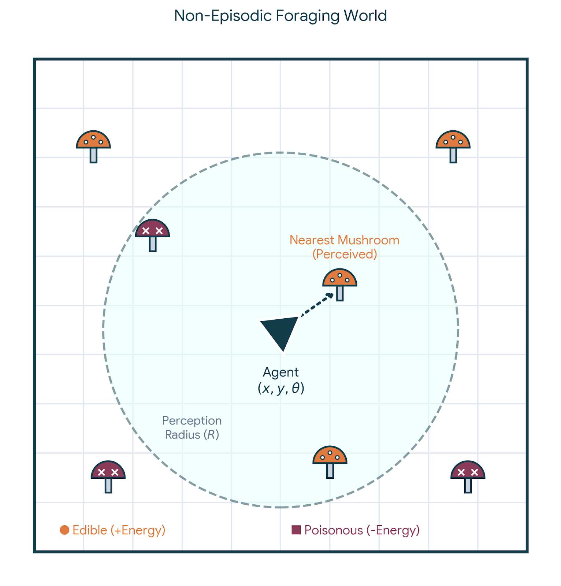
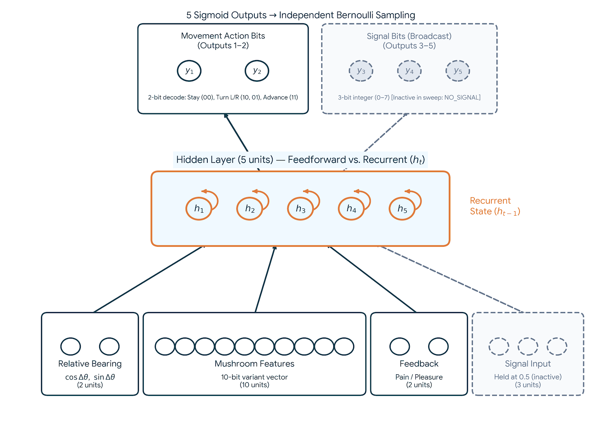
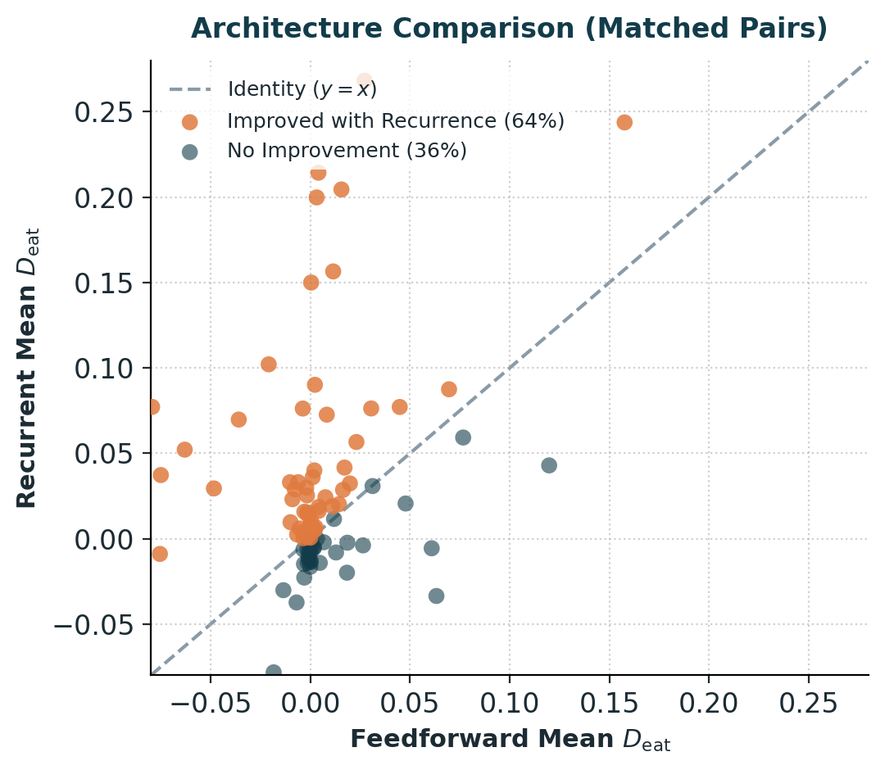
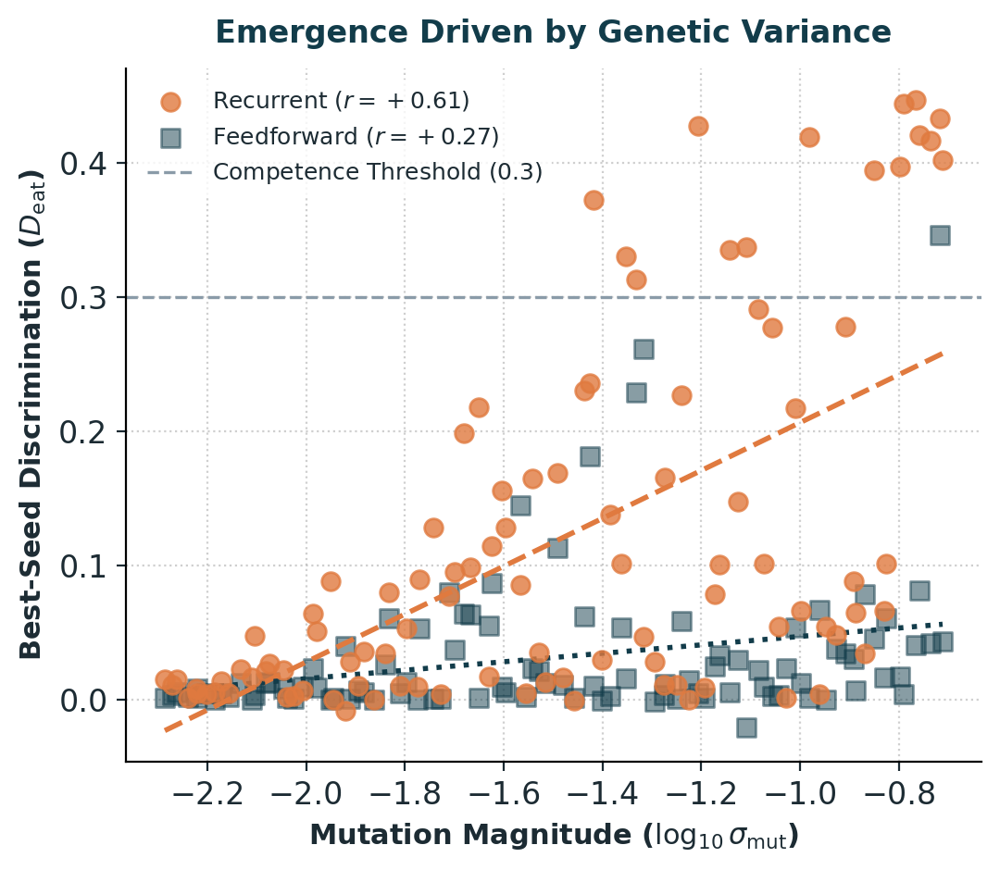

# Emergence of Feature-Based Discrimination in a Non-Episodic Evolutionary Foraging Model

[](#)
[](#)


**Author:** Migara Kumarasinghe  
*Independent Researcher, London, UK*  
Presented at **ALIFE 2026** (Poster LB135, Thursday Session).

---

## 📌 Motivation

In their seminal 1998 work, Cangelosi & Parisi demonstrated the emergence of communicative signalling among artificial agents in an **episodic** setting as a by-product of selection on foraging success. Foraging required **feature-based discrimination**—the capacity to distinguish edible and poisonous mushrooms based on perceptual features.

This project investigates the emergence of feature discrimination under **open-ended, non-episodic evolution**:
* Agents forage, reproduce, and die in a single shared, continuous world without resets.
* There is **no explicit fitness function**; survival and reproduction depend purely on metabolic balance.
* **Goal:** Determine the minimal cognitive (architectural) and evolutionary conditions required for individual feature discrimination to emerge before introducing communicative selection pressures.

---

## 🔬 Model & Architecture

<p align="center">
  
  
</p>

* **World:** A $100 \times 100$ toroidal gridworld supporting a persistent population (up to 5,000 agents, seeded with 2,000) with 100 mushrooms (50 edible, 50 poisonous).
* **Agents & Controller:** Neural controllers with 5 hidden units mapping **17 local sensory inputs**:
  * Relative bearing ($\cos\Delta\theta, \sin\Delta\theta$)
  * Nearest 10-bit feature vector
  * Optional 2-unit consumption feedback (pain/pleasure)
  * 1 inactive signal input
  * **Output:** 2 discrete movement action probabilities.
  * **Architectures Compared:** Feedforward MLP vs. Recurrent Neural Network with persistent hidden states ($h_t$).
* **Items:** Mushrooms drawn from two class prototypes in a 10-bit feature space (single-bit-flip variants). Edible items yield energy gain; poisonous items inflict an energy penalty scaled by severity.
* **Metabolism & Reproduction:** Energy decays per step and via movement. When an agent exceeds an energy threshold, it spawns a Gaussian-mutated offspring into an adjacent cell.

---

## 🧪 Experimental Design & Evaluation

### Latin Hypercube Sweep & Ablation
* **500-Run Sweep:** 100 parameter configurations $\times$ 5 random seeds using a **matched-pairs design** (varying mutation magnitude, poison severity, reproduction cost, and energy decay across both architectures).
* **$2 \times 2$ Ablation (300 runs):** Tested 20 configurations across Recurrence $(\pm) \times$ Pain/Pleasure Feedback $(\pm)$ to isolate the role of memory vs. immediate reinforcement cues.

### Discrimination Metric ($D_{\text{eat}}$)
To strictly capture feature-based perception rather than reinforcement avoidance, individual agents are isolated on a clean grid and evaluated across all feature variants and approach directions:

$$D_{\text{eat}} = \bar{E}_{\text{edible}} - \bar{E}_{\text{poison}}$$

where $\bar{E}$ is the fraction of rollouts ending in consumption (8 stochastic rollouts per condition, evaluated without consequence feedback).

---

## 📊 Key Results

<p align="center">
  
  
</p>

| Finding | Feedforward | Recurrent | Takeaway |
| :--- | :--- | :--- | :--- |
| **Mean $D_{\text{eat}}$** | $-0.001$ | $+0.029$ | Recurrence provides the substrate for discrimination ($p = 2.5 \times 10^{-4}$). |
| **Configs $> 0.3$ (Best Seed)** | $1 / 100$ | $15 / 100$ | Competence is achievable but rare across parameter space. |
| **Primary Driver** | Repro Cost ($r = -0.40$) | Mutation Magnitude ($r = +0.61$) | High genetic variance is crucial for recurrent emergence. |

* **Recurrence is the Primary Driver:** Ablation confirms recurrent hidden states account for performance gains (main effect $+0.077$, $p = 0.001$). Consequence signals (pain/pleasure) had no significant effect ($p = 0.706$).
* **Mutation Magnitude Threshold:** No configuration in the lowest quartile of mutation magnitude achieved competence ($D_{\text{eat}} > 0.3$).

---

## 💡 Discussion

1. **Fragility of Emergent Discrimination:** Recurrence does not guarantee high discrimination; it acts as a necessary computational substrate that succeeds only under specific evolutionary regimes.
2. **Exploration vs. Variance:** The strong positive correlation ($r = +0.61$) between recurrent competence and mutation magnitude points to the need for broad parameter space exploration under non-episodic dynamics.
3. **Foundation for Signalling:** Establishing individual perceptual discrimination isolates the cognitive baseline needed before evaluating shared communicative pressures.

---

## 📚 References & Acknowledgements

* **Primary Reference:**  
  Cangelosi, A., & Parisi, D. (1998). *The emergence of a language in an evolving population of neural networks.* Connection Science, 10(2), 83–97.

* **Funding & Support:**  
  Registration supported by the **Igor Ivkovic Acts of Kindness Award.

* **AI Assistance Disclosure:**  
  Claude (Anthropic) was used to assist with some code development; the author reviewed, tested, and validated all code.

* **Citation (BibTeX):**
  ```bibtex
  @misc{kumarasinghe2026emergence,
    title={Emergence of Feature-Based Discrimination in a Non-Episodic Evolutionary Foraging Model},
    author={Kumarasinghe, Migara},
    howpublished={Poster presented at ALIFE 2026 (LB135)},
    year={2026}
  }
---
## 🛠️ Repository & Implementation

* Built with **[JAX](https://github.com/google/jax)** and **[Equinox](https://github.com/patrick-kidger/equinox)** for accelerated gridworld rollouts.
* Includes scripts for:
  * Non-episodic evolutionary simulation loop
  * Latin Hypercube parameter sampling
  * Clean grid $D_{\text{eat}}$ probing suite

```bash
# Clone the repository
git clone [https://github.com/migarak2908/mushroom_world.git](https://github.com/migarak2908/mushroom_world.git)
cd mushroom_world

# Install dependencies (ensure appropriate CUDA/JAX version is installed)
pip install -r requirements.txt

